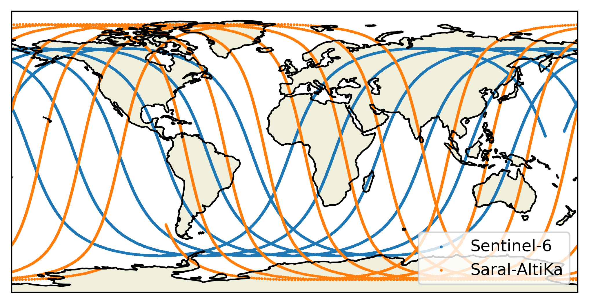
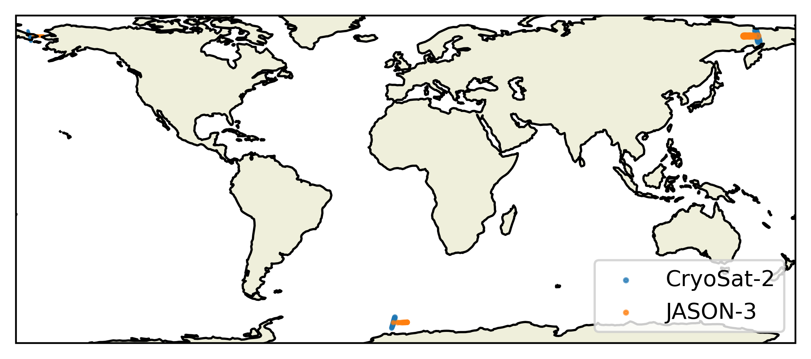

.. _quickstart:

################
Quickstart Guide
################

Installing orbitx
#################

The Orbit class
###############

The `Orbit` class is used to simulate the orbits of satellites.
It relies on `orekit` to simulate the position of satellites based on Two Line Elements (TLE) and on a linear interpolation to obtain a sufficiently fine time resolution while keeping compute time low enough.

A basic use of this class is as follows:

.. code-block:: python3

    from orbitx import Orbit, Matchups
    import datetime

    orbit = Orbit.simulate(
        satellites=["S6", "SA"],
        start_time=datetime.datetime(2020, 2, 1, 0, 0, 0),
        end_time=datetime.datetime(2020, 2, 1, 12, 0, 0),
        propagation_sampling_interval=20,
        interpolation_sampling_interval=5
    )

    print(orbit)

.. code-block:: text

    Orbit object for satellites ['CS2', 'J2'].
    Start date: 2012-01-01 00:00:00
    End date: 2012-01-01 12:00:00
    Propagation sampling interval: 60
    Interpolation sampling interval: 5
    Number of simulated times: 8641

The `satellites` attribute is a list of satellite short names of arbitrary length.
The supported short names are currently the following ones:

.. code-block:: text

    "LS8": "Landsat-8",
    "LS9": "Landsat-9",
    "S2A": "Sentinel-2A",
    "S2B": "Sentinel-2B",
    "S3A": "Sentinel-3A",
    "S3B": "Sentinel-3B",
    "S6": "Sentinel-6",
    "J2": "JASON-2",
    "J3": "JASON-3",
    "SA": "Saral-AltiKa",
    "CS2": "CryoSat-2",
    "LINCS2": "Lin-CryoSat-2",
    "N20": "NOAA-20" 

An orbit object can simply be plotted with a call to the `plot` method of the class:

.. code-block:: python3

    orbit.plot()

The core of an `Orbit` class object is its `orbits` attribute.
It contains a nested dictionnary, with one entry per requested satellite.
Each satellite entry contains the `lat` (lattitude), `lon` (longitude), `time` (time of the simulated position in seconds since 1970), `time_datetime` (time of the simulated position in a `datetime` format).

.. code-block:: python3

    print(orbit.orbits)

.. code-block:: text

    {
        'CS2': {
            'lat': array([-74.15645752, -74.36682531, -74.5771931 , ..., -56.29122754, -58.33525305, -60.37927857], shape=(8641,)),
            'lon': array([  71.45679019,   81.22522576,   90.99366134, ..., -124.07410594, -123.42313735, -122.77216877], shape=(8641,)),
            'time': array([1.32537600e+09, 1.32537600e+09, 1.32537601e+09, ..., 1.32541919e+09, 1.32541920e+09, 1.32541920e+09], shape=(8641,)),
            'time_datetime': array([datetime.datetime(2012, 1, 1, 0, 0), datetime.datetime(2012, 1, 1, 0, 0, 5), datetime.datetime(2012, 1, 1, 0, 0, 10), ..., datetime.datetime(2012, 1, 1, 11, 59, 50), datetime.datetime(2012, 1, 1, 11, 59, 55), datetime.datetime(2012, 1, 1, 12, 0)], shape=(8641,), dtype=object)
        },
        'J2': {
            'lat': array([-44.56685663, -44.78376038, -45.00066412, ...,  13.63047882, 13.87435618,  14.11823355], shape=(8641,)),
            'lon': array([49.52344903, 49.72488617, 49.92632331, ..., 28.37651745, 28.46935208, 28.56218672], shape=(8641,)),
            'time': array([1.32537600e+09, 1.32537600e+09, 1.32537601e+09, ..., 1.32541919e+09, 1.32541920e+09, 1.32541920e+09], shape=(8641,)),
            'time_datetime': array([datetime.datetime(2012, 1, 1, 0, 0), datetime.datetime(2012, 1, 1, 0, 0, 5), datetime.datetime(2012, 1, 1, 0, 0, 10), ..., datetime.datetime(2012, 1, 1, 11, 59, 50), datetime.datetime(2012, 1, 1, 11, 59, 55), datetime.datetime(2012, 1, 1, 12, 0)], shape=(8641,), dtype=object)
        }
    }

An `Orbit` object can be exported to netCDF4 format and loaded from such a file as well (as long as the structure is as expected).

.. code-block:: python3

    orbit.to_netcdf("./test_export/")

.. code-block:: python3

    new_orbit = Orbit.from_netcdf("./test_export/")

    print(new_orbit == orbit)

.. code-block:: text

    True

The Matchup class
#################

.. code-block:: python3

    from orbitx import Matchups
    import datetime

    matchups = Matchups.find_matchups(
        satellites=["CS2", "J3"],
        start_time=datetime.datetime(2012, 1, 1, 0, 0, 0),
        end_time=datetime.datetime(2012, 1, 1, 12, 0, 0),
        propagation_sampling_interval = 60,
        interpolation_sampling_interval = 5,
        space_diff_threshold = 290,
        time_diff_threshold = 900,
        check_before = True,
        check_after = True,
        has_land_ocean_mask = True,
    )
    print(matchups)

.. code-bloc:: text

    Matchup object with following attributes:
    Satellites considered: ['CS2', 'J3']
    Date from which matchups are looked for: 2012-01-01 00:00:00
    Date until which matchups are looked for: 2012-01-01 12:00:00
    Maximum time difference between members of a matchup: 900 (seconds)
    Maximum distance between members of a matchup: 290
    Are matchups in which on of the satellites appears before the start date considered? True
    Are matchups in which on of the satellites appears after the end date considered? True
    Has this matchup a land/ocean mask? True
    Number of matchups found: 53

.. code-bloc:: python3

    matchups.plot()

.. code-bloc:: python3

    print(matchups.matchups)

.. code-bloc:: text

    <xarray.Dataset> Size: 5kB
    Dimensions:         (time: 53)
    Coordinates:
    * time            (time) float64 424B 1.325e+09 1.325e+09 ... 1.325e+09
    Data variables:
        lat1            (time) float64 424B 63.72 64.02 64.32 ... 68.01 68.31 68.61
        lon1            (time) float64 424B -173.1 -173.2 -173.3 ... 160.7 160.7
        lat2            (time) float64 424B 66.12 66.13 66.08 ... 66.11 66.1 66.1
        lon2            (time) float64 424B -171.3 -170.0 -168.8 ... 157.8 159.0
        distance        (time) float64 424B 279.4 276.8 285.9 ... 283.5 276.9 287.3
        time_datetime   (time) datetime64[ns] 424B 2012-01-01T09:54:25 ... 2012-0...
        time2           (time) float64 424B 1.325e+09 1.325e+09 ... 1.325e+09
        time_datetime2  (time) datetime64[ns] 424B 2012-01-01T09:44:50 ... 2012-0...
        delay           (time) float64 424B 575.0 570.0 565.0 ... -75.0 -80.0 -85.0
        land_mask_1     (time) <U1 212B 'O' 'O' 'O' 'O' 'O' ... 'O' 'O' 'O' 'O' 'O'
        land_mask_2     (time) <U1 212B 'O' 'O' 'O' 'O' 'O' ... 'O' 'O' 'O' 'O' 'O'
        matchup_type    (time) <U1 212B 'O' 'O' 'O' 'O' 'O' ... 'O' 'O' 'O' 'O' 'O'
    Attributes:
        satellites:            ['CS2', 'J3']
        start_time:            2012-01-01 00:00:00
        end_time:              2012-01-01 12:00:00
        time_diff_threshold:   900
        space_diff_threshold:  290
        check_before:          True
        check_after:           True
        has_land_ocean_mask:   True
        sat1:                  CS2
        sat2:                  J3

Running in parallel
###################